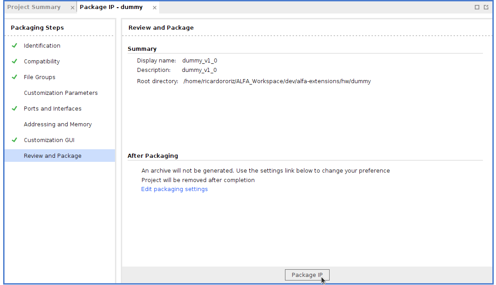

# ALFA installation and setup: Xilinx Zynq UltraScale+ MPSoC ZCU104 

The following steps are a guide to run ALFA on the Xilinx Zynq UltraScale+ MPSoC ZCU104 board. The <a href="https://www.xilinx.com/products/boards-and-kits/zcu104.html">ZCU104 Evaluation Kit</a> features a Zynq UltraScale+ MPSoC, equipped with a quad-core ARM Cortex-A53 applications processor, dual-core Cortex-R5 real-time processor, Mali-400 MP2 graphics processing unit, 4KP60 capable H.264/H.265 video codec, and programmable logic (FPGA). It is assumed that you already have installed the Desktop version of ALFA and therefore, all ALFA repositories are already in your system. If not, jump [here](https://github.com/alfa-project/alfa-platforms/Desktop/README.md) before starting this guide.

This guide was based on: <https://news.accelerationrobotics.com/ros2-humble-yocto-petalinux/>, further complemented with the official Reference Guide from Xilinx: <https://docs.xilinx.com/r/en-US/ug1144-petalinux-tools-reference-guide> and tested with:

- ROS2 Foxy distribution.
- Xilinx Petalinux 2022.2.
- Host distribution: Ubuntu 22.04.

## Tools Installation 

### Download and Install Xilinx's PetaLinux 2022.2 (that comes with Honister) 

**Note**: If you have limited disk space, you can use an external hdd for these tasks, as creating a petalinux can require up to 100GB of free space on your local disk to download and build software packages. Nonetheless, by doing so, paths may differ from the ones presented in the guide.

Create a folder named 'embedded' inside your ALFA local folder:

```sh
mkdir -p ALFA/embedded
```

Download the petalinux installer from Xilinx website ([link](https://www.xilinx.com/support/download/index.html/content/xilinx/en/downloadNav/embedded-design-tools.htm)) (registration is required) and place it inside the 'embedded' folder. From this folder, change the file properties to make it executable and run it (you can also select an installation dir with -d option):

```sh
chmod 755 ./petalinux-v<petalinux-version>-final-installer.run
```

```sh
./petalinux-v<petalinux-version>-final-installer.run -d <INSTALL_DIR>
```

**Note**: Install any other possible missing dependencies/libraries reported by the installer.

Source its settings:

```sh
source settings.sh
```

### Create a project with the ALFA hardware xsa 

To create a project for the zcu104, inside the ‘projects’ dir run petalinux-create command (***-n** defines the name of the project and -t the name of the base template*):

```sh
petalinux-create --type project --template zynqMP --name alfa_zcu104
```

```sh
cd alfa_zcu104
```

```sh
petalinux-config --get-hw-description=<PATH_TO_ALFA_PLATFORMS_REP>/Xilinx/hardware/zcu104.xsa
```

### Add meta-layers for ROS 2 FOXY and configure them in PetaLinux 

Create a new folder named "layers" inside your projects/<NAME_OF_YOUR_PROJECT> folder. This folder will hold the new layers that we will add to the project. Inside the layers folder, clone the meta-ros layers from github. The Petalinux downloaded version matches the Yocto Honister release so we must also align with that:

```sh
git clone -b honister https://github.com/ros/meta-ros.git 
```

The 2022 version of petalinux already adds meta-ros layers, however, at the time of this tutorial, they did not compile correctly with the PCL so we changed the ROS2 version from humble to foxy release.

Add the following into the \<project folder\>/build/conf/bblayers.conf file in the BBLAYERS definition, for the meta-ros recipes. If there are already any ros lines, delete them and add the following:

```sh
${SDKBASEMETAPATH}../../layers/meta-ros/meta-ros-common \
${SDKBASEMETAPATH}../../layers/meta-ros/meta-ros2 \
${SDKBASEMETAPATH}../../layers/meta-ros/meta-ros2-foxy \
```

As petalinux by default uses ROS2 humble, we have to change the default ROS_DISTRO. Edit \<project folder\>/components/yocto/layers/meta-petalinux/conf/distro/petalinux.conf to change the variable ROS_DISTRO to foxy:

```sh
ROS_DISTRO = "foxy"
```

### Extend the minimal image to support ROS 2 

Update petalinux image to include the new ROS2 content. For that we need to create a new recipe file to extend the petalinux-image-minimal to a custom one. Inside the project workspace create a new dir and an empty file called “ros-petalinux.bb”:

```sh
mkdir -p project-spec/meta-user/recipes-image/images
```

Inside the images dir create an empty file ros-petalinux.bb:

```sh
touch ros-petalinux.bb
```

Open the file and insert the following lines:
<details>
  <summary>Click to expand</summary>

```sh
require ${COREBASE}/../meta-petalinux/recipes-core/images/petalinux-image-minimal.bb

SUMMARY = "A small image just capable of starting ROS2."
DESCRIPTION = "${SUMMARY}"

inherit ros_distro_${ROS_DISTRO}
inherit ${ROS_DISTRO_TYPE}_image

ROS_SYSROOT_BUILD_DEPENDENCIES = " \
 ament-lint-auto \
 ament-cmake-auto \
 ament-cmake-core \
 ament-cmake-cppcheck \
 ament-cmake-cpplint \
 ament-cmake-export-definitions \
 ament-cmake-export-dependencies \
 ament-cmake-export-include-directories \
 ament-cmake-export-interfaces \
 ament-cmake-export-libraries \
 ament-cmake-export-link-flags \
 ament-cmake-export-targets \
 ament-cmake-gmock \
 ament-cmake-gtest \
 ament-cmake-include-directories \
 ament-cmake-libraries \
 ament-cmake \
 ament-cmake-pytest \
 ament-cmake-python \
 ament-cmake-ros \
 ament-cmake-target-dependencies \
 ament-cmake-test \
 ament-cmake-version \
 ament-cmake-uncrustify \
 ament-cmake-flake8 \
 ament-cmake-pep257 \
 ament-copyright \
 ament-cpplint \
 ament-flake8 \
 ament-index-python \
 ament-lint-cmake \
 ament-mypy \
 ament-package \
 ament-pclint \
 ament-pep257 \
 ament-pycodestyle \
 ament-pyflakes \
 ament-uncrustify \
 ament-xmllint \
 cmake \
 eigen3-cmake-module \
 fastcdr \
 fastrtps-cmake-module \
 fastrtps \
 git \
 gmock-vendor \
 gtest-vendor \
 pkgconfig \
 python-cmake-module \
 python3-catkin-pkg \
 python3-empy \
 python3 \
 python3-nose \
 python3-pytest \
 rcutils \
 rmw-implementation-cmake \
 rosidl-cmake \
 rosidl-default-generators \
 rosidl-generator-c \
 rosidl-generator-cpp \
 rosidl-generator-dds-idl \
 rosidl-generator-py \
 rosidl-parser \
 rosidl-runtime-c \
 rosidl-runtime-cpp \
 rosidl-typesupport-c \
 rosidl-typesupport-cpp \
 rosidl-typesupport-fastrtps-cpp \
 rosidl-typesupport-interface \
 rosidl-typesupport-introspection-c \
 rosidl-typesupport-introspection-cpp \
 foonathan-memory-vendor \
 libyaml-vendor \
"

IMAGE_INSTALL:append = " \
 ros-base \
 cyclonedds \
 rmw-cyclonedds-cpp \
 tmux \
 byobu \
 python3-argcomplete \
 glibc-utils \
 localedef \
 rt-tests \
 stress \
 xrt-dev \
 xrt \
 zocl \
 opencl-headers-dev \
 opencl-clhpp-dev \
 ${ROS_SYSROOT_BUILD_DEPENDENCIES} \
"

EXTRA_IMAGE_FEATURES += "ros-implicit-workspace"

```

</details>

Save and close the file.

### Add ALFA components or other custom applications 

In order to add the ALFA layer to the project, we need to add its path to the project configuration file. Open the file \<project folder\>/build/conf/bblayers.conf and add the following line to the BBLAYERS definition:

```sh
${SDKBASEMETAPATH}../../../meta-alfa \
```

Include the following lines into the device tree user file located in <YOUR_PROJECT_DIR/>/project-spec/meta-user/recipes-bsp/device-tree/files/system-user.dtsi

<details>
  <summary>Click to expand</summary>

```sh
/include/ "system-conf.dtsi"
/ {
 reserved-memory {
  #address-cells = <2>;
  #size-cells = <2>;
  ranges;
  
  reserved_cachable_alfa: reserved_cachable_alfa@5000000 {
   compatible = "shared-dma-pool";
   reg = <0x0 0x50000000 0x0 0x1000000>;
   cache-policy = "writeback";
   access = "read-write";
   no-map;
  };
  
  reserved_non_cachable_alfa: reserved_non_cachable_alfa@40000000 {
   compatible = "shared-dma-pool";
   reg = <0x0 0x40000000 0x0 0x1000000>;
   no-map;
  };
  };
    
  alfadd: alfadd{
   status = "okay";
   compatible = "alfadd";
   reg = <0x0 0x40000000 0x0 0x1000000>, <0x0 0x50000000 0x0 0x1000000>;
 };
  axi_cdma_0 {
  status = "disabled";
 };
 };
```

</details>

Update ros-petalinux.bb receipe inside the folder "project-spec/meta-user/recipes-image/images" with the desired alfa components under 'IMAGE_INSTALL:append':

```sh
 alfadd \
 alfa-msg \
 alfa-node \
```

Add the following line at the end of the file to load the ALFA device driver during boot:

```sh
KERNEL_MODULE_AUTOLOAD = "alfadd"
```

Since ALFA extensions require root access to physical memory (will be fixed soon), the final image must be configurated to enable it. Run the following command inside your project folder and select the *Petalinux RootFS Settings* menu.

```sh
petalinux-config -c rootfs
```

Redefine the root password in the first submenu by changing *root:root* to *root:YOURPASSWORD*. Select Save and then exit the menu.

Finally run the build process again, with the updated recipe:

```sh
petalinux-build -c ros-petalinux
```

### Build and test the image 

Run petalinux-build to build the system image:

```sh
petalinux-build
```

This should create an image for zcu104 and display no errors. If errors do appear it can be for multiple reasons, e.g., corrupted downloaded files, memory/ram issues, disk space in the hard drive, network-related issues, etc. You can monitor the memory utilization during the building process with the “htop” command.

The build images are located in the \<plnx-proj-root\>/images/linux directory. A copy is also placed in the /tftpboot directory if the option is enabled in the system-level configuration for the PetaLinux project.

**Important:** By default, besides the kernel, RootFS, and U-Boot, the PetaLinux project is configured to generate and build the other boot components for Zynq FSBL, for Zynq UltraScale+ MPSoC FSBL and PMU firmware and for Versal PLM and PSM firmware. For more details on the auto generated boot components, see [UG1144 - Generating Boot Components](https://docs.xilinx.com/r/en-US/ug1144-petalinux-tools-reference-guide/Generating-Boot-Components).

The selected boot components must be compiled into the boot image to be placed in the flash memory or an SD card. A boot image usually contains a first stage boot loader image (Zynqmp_fsbl.elf), FPGA bitstream (project1.bit), PMU firmware (pmufw.elf), TF-A (bl31.elf), device tree description (system.dtb), and U-Boot (u-boot.elf).

Execute the following command to generate the boot image in .BIN format with these components:

```sh
petalinux-package --boot --fpga --u-boot
```

Later, after creating your own FPGA bitstream file, you can manually include it in the boot.bin:

```sh
petalinux-package --boot --fpga <path-to-file>/system.bit --u-boot
```

Use the wic packaging tool to create a ready to use SD Card image with the following command:

```sh
petalinux-package --wic
```

**Note:** The default image generated by petalinux is around 6GB. This much more than we actually need. To change this, we can customize the wks file used by wic by changing the partition size accordingly. The default rootfs.wks file can be found inside the build directory. This file is autogenerated. Copy it to the 'projects' directory, change the size of the boot and filesystem partitions, and include it with the petalinux-package command:

```sh
petalinux-package --wic --wks <path-to-file>/rootfs.wks 
```

The rootfs can also be changed with petalinux (optional) to remove unwanted packages. This will also help in reducing the final image’s size:

```sh
petalinux-config -c rootfs
```

Flash the created petalinux-sdimage.wic image into the SD card. This file can be found inside the project folder/images/linux. Using dd command (change the bs parameter accordingly. This will highly increase the flashing process):

```sh
sudo dd if=petalinux-sdimage.wic of=/dev/sda conv=fsync bs=8M
```

Or you can use the pv command. This gives a fancy progress bar and selects the best block size parameter:

```sh
sudo bash -c 'pv *.wic > /dev/sda'
```

Finally, insert the sd card into the board and boot. Login with the root user and the password defined in the rootfs configuration.

## Install Embedded Software extensions

To include the extensions in the embedded image, a recipe file must be created for each extension. You can see the already existing recipes (.bb files) in the meta-alfa/recipes-alfa/alfa-extensions folder. The following steps will show you how you can include the dummy extension into the embedded image. In this case, we already provide a recipe file for the dummy extension, which can be used as starting point for your new extensions.

Firstly, update the ros-petalinux.bb receipt (inside folder "/project-spec/meta-user/recipes-image/images") with the desired ALFA extension, in this case ext-dummy, under 'IMAGE_INSTALL:append':

```sh
 ext-dummy \
```

Then go to your project folder and rerun the following command to update the image:

```sh
petalinux-build -c ros-petalinux
```

Create the SD Card image with the wic command:

```sh
petalinux-package --wic
```

And finally, copy the image to the SD Card (check the SD Card device name before running the command):

```sh
sudo dd if=images/linux/petalinux-sdimage.wic of=/dev/sda conv=fsync bs=8M
```

**Jump to [ALFA extensions](https://github.com/alfa-project/alfa-extensions) to see how to run and interact with dummy node after booting your board.**

## Install Embedded Hardware extensions

To use hardware extensions with the ZCU104 board, you need to [install Xilinx's Vivado](https://www.xilinx.com/support/download.html). At the time of this writing ALFA has been tested with Vivado Design Suite - HLx Editions - 2022.2. We recommend you to get familiarized with this tool suite before developing hardware Extensions. Useful documentation can be found here: [Vivado Design Suit User Guide UG910](https://docs.xilinx.com/r/en-US/ug910-vivado-getting-started).

### Create an ALFA project, add the extension and generate the bitstream

ALFA projects can be created using the TCL script that setups all components and the required configurations. To run this script, go to Xilinx/scripts/ folder, make the script *setup_vivado_project* executable if is not already and run it with the name of the project that you want and the board as argument (only zcu104 is supported at the moment):

```sh
cd PATH_TO_ALFA_PLATFORMS/Xilinx/scripts
```

```sh
chmod +x setup_vivado_project
```

```sh
./setup_vivado_project <project_name> <board>
```

The script will open the Vivado GUI and create a new project with the name provided as argument (the project will be created in the folder *PATH_TO_ALFA_FRAMEWORK/alfa-platforms/vivado_projects/<project_name>*). Then, it will add the ALFA unit and board SoC to the design. Add the extension to the block design and connect all the remaining unconnected interfaces.

**Note**: only the native extensions will appear automatically in the IP catalog. Your extensions IP must be included in this project IP catalog to make them available in block design.

Please adjust the number of Debug Points and User Define interfaces required for your extension. Finally, create a wrapper for the design and proceed to generate the bitstream.

### Enable ALFA hardware extensions in the ALFA-Node

The ALFA-Node has the capability to run hardware extensions when the extensions are compiled with EXT_HARDWARE compilation flag defined. This flag is defined in the CMakeLists.txt of the extensions and can be toggled on and off by commenting the line with a "#":

```cmake
20. add_compile_definitions(EXT_HARDWARE)
```

**Note:** This flag alters the node behavior to accommodate the hardware extensions. Therefore, developers when developing their extensions must define the extension behavior when this flag is defined. Check the dummy extension src files for an example of how to do this.

Update, if not already, the ros-petalinux.bb receipt inside folder "/project-spec/meta-user/recipes-image/images" with the desired ALFA extensions under 'IMAGE_INSTALL:append':

```sh
 ext-dummy \
```

Then go to your project folder and rerun the following command to update the image:

```sh
petalinux-build -c ros-petalinux
```

Add the generated bitstream into the final image with the command:

```sh
petalinux-package --boot --fpga <PATH_TO_YOUR_BITSTREAM>/<BITSTREAM_FILE_NAME>.bit --u-boot --force
```

Create the SD Card image with the wic command:

```sh
petalinux-package --wic
```

And finally, copy the image to the SD Card (check the SD Card device name before running the command):

```sh
sudo dd if=images/linux/petalinux-sdimage.wic of=/dev/sda conv=fsync bs=8M
```

## Package and create new ALFA hardware extensions

In order to create and maintain the best environment for your extensions, we advise the usage of the package IP tool provided by Vivado. By doing it so, the step to include your extension in the ALFA environment will be the same as the native extensions.

The following steps describe how to package ALFA hardware extensions, using dummy extension as an example. Those are meant to be done in Xilinx's Vivado, with a project already created for your board and with the extension source files already in your computer. Start including the ALFA hardware components to the IP catalog:

1. Enter into the menu Window ⇾ IP Catalog.

    

2. Right click on Vivado Repository ⇾ Add Repository...

    

3. Select the path to the alfa-unit repository (PATH_TO_ALFA_FRAMEWORK_REP/alfa-framework/alfa-unit). If the right path is selected, a pop-up will show that 1 IP and 5 interfaces were added to the project.

    

4. The ALFA-Unit IP should appear on Block Design's IP list.

    

Then, package the extension with your hardware files and the ALFA interfaces:

1. Go to the **Tools** menu and select the **Create and Package New IP...**

    

2. After pressing **Next** in the first menu, select the option "Package a specified directory" in the Package Options section. Then press **Next**.

3. Select the dummy extension directory (directory containing all the hardware files ⇾ PATH_TO_ALFA_FRAMEWORK/alfa-extensions/hw/ext_dummy/) and press **Next**.

4. Then, change the *Project name* field to "dummy_extension" and let the Project location be the default path for your Vivado projects.

5. Finishing the process by clicking *Finish*. A new Vivado window will pop-up with your dummy extension package on it.

6. In order to take full advantage of Vivado Block Design features, we need to identify the ALFA interfaces present in the dummy. Select the menu *Port and Interfaces* of the Package IP and select the menu *Auto infer interface*:

    

7. Select User⇾Cartesian_representation_rtl and press *OK*. (**Note**: if none of ALFA interfaces are shown in the menu, the ALFA interfaces are not present in the IP catalog. For more information, check the [ALFA-Unit Integration section](https://github.com/alfa-project/alfa-unit#integration))

    

8. Repeat the process for the User⇾Extension_Interface_rtl.

9. The *Ports and interfaces* menu should look like this:

    

10. Associate the clock signal for both interfaces by right-clicking on top of them and selecting associate clock. Then select the *i_SYSTEM_clk* checkbox and press *OK*.
  
      

11. Select the *Review and Package* submenu and press the *Package IP* button to finalize the process of packaging the ALFA extension:

    

To use the generated IP, you can follow the [steps above](#create-an-alfa-project-add-the-extension-and-generate-the-bitstream) to include the extension in the ALFA project and generate the bitstream. Then, **Jump to [ALFA extensions](https://github.com/alfa-project/alfa-extensions) to see how to run and interact with dummy node after booting your board.**